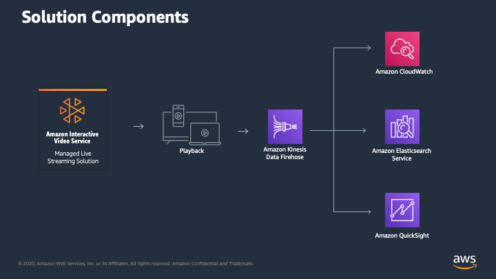
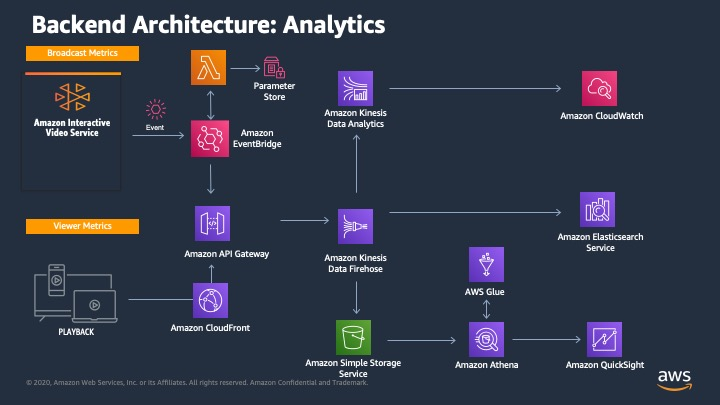
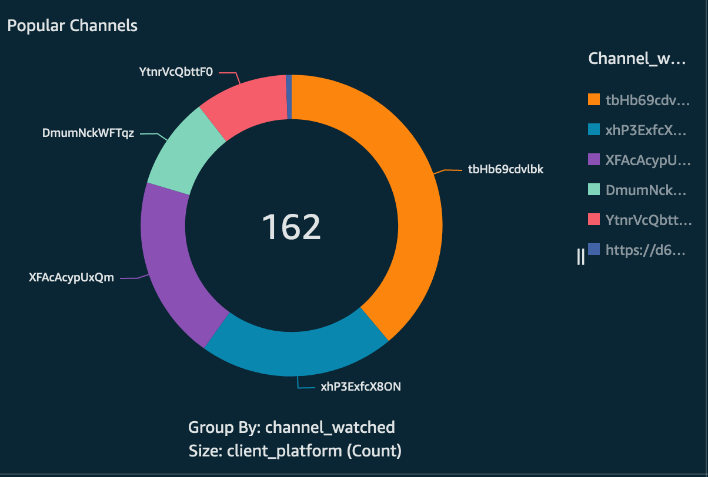
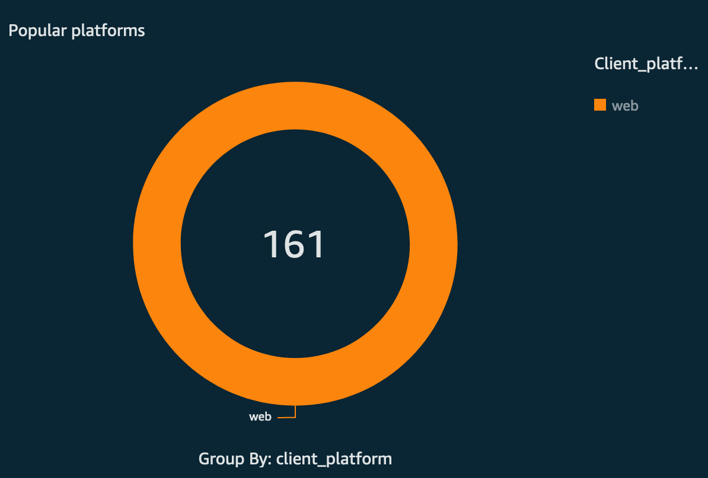
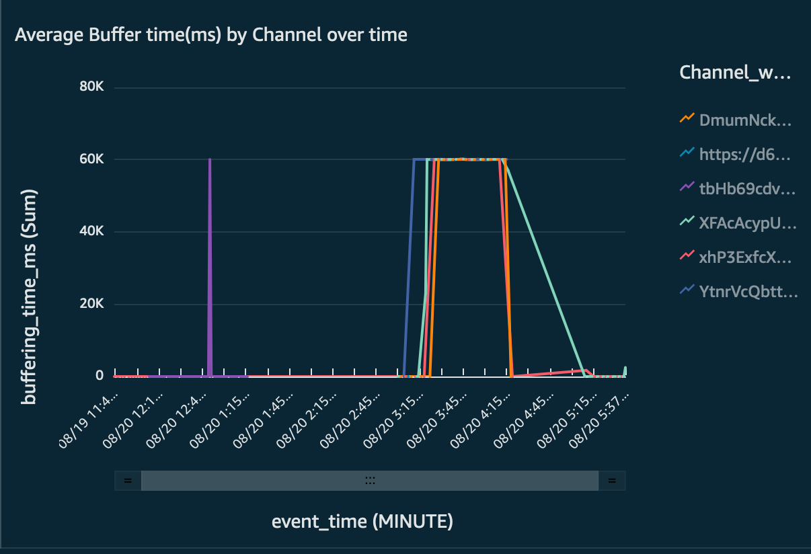
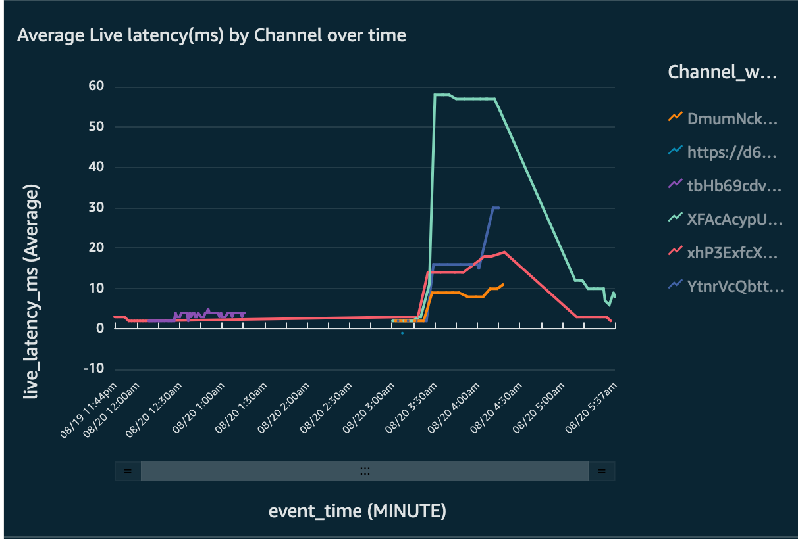

## Amazon IVS Quality of Service Dashboard Sample

This is a sample application for use measuring the performance and audience experience for streaming video delivered via [Amazon Interactive Video Service](https://aws.amazon.com/ivs/).

This application consists of two core components:

* an integration with the [IVS player SDK](https://docs.aws.amazon.com/ivs/latest/userguide/SWPG.html) to capture metrics recording the viewer experience while watching and interacting with video served by the IVS Player. 
* A backend solution which captures, processes and presents the metrics in the form of an ElasticSearch based Dashboard which can be used to monitor and observe user experiences when watching streams served by IVS. 

## Getting Started with the Amazon IVS Quality of Service Dashboard

* [Deployment](#Deployment)
* [Architecture Overview](#Architecture)
* [Contributing](#Contributing)
* [Security](#Security)
* [License](#License)

## Deployment

### Launching solution with Pre-built AWS CloudFormation Template

The solution is deployed using an AWS CloudFormation template with AWS Lambda backed custom resources. To deploy the solution, use one of the following CloudFormation templates and follow the instructions below.

| AWS Region | AWS CloudFormation Template URL |
|:-----------|:----------------------------|
| EU (Ireland) |<a href="https://console.aws.amazon.com/cloudformation/home?region=eu-west-1#/stacks/new?stackName=ivsqos&templateURL=https%3A%2F%2Fivsqos-github-templates-eu-west-1.s3-eu-west-1.amazonaws.com%2Fqos%2Fv0.4%2Ftemplates%2Fdeployment.yaml" target="_blank">Launch stack</a> |
| US (N.Virginia) |<a href="https://console.aws.amazon.com/cloudformation/home?region=us-east-1#/stacks/new?stackName=ivsqos&templateURL=https%3A%2F%2Fivsqos-github-templates-us-east-1.s3.amazonaws.com%2Fqos%2Fv0.4%2Ftemplates%2Fdeployment.yaml" target="_blank">Launch stack</a> |
| US (Oregon) |<a href="https://console.aws.amazon.com/cloudformation/home?region=us-west-2#/stacks/new?stackName=ivsqos&templateURL=https%3A%2F%2Fivsqos-github-templates-us-west-2.s3-us-west-2.amazonaws.com%2Fqos%2Fv0.4%2Ftemplates%2Fdeployment.yaml" target="_blank">Launch stack</a> |

### CloudFormation Deployment

1. The demo deployment included with the solution is configured to use a publicly available IVS test stream. If you wish to use your own stream in the demo, review the [IVS Getting Started](https://docs.aws.amazon.com/ivs/latest/userguide/GSIVS.html) and follow this process to create a channel. 
2. Once the channel is created, note the Playback URL displayed in the console.
3. Deploy the CloudFormation template in your chosen AWS Region by clicking on the appropriate link above.
4. When prompted for the PlaybackURL Parameter at step 2 of the CloudFormation Stack Deployment, enter the IVS Stream Playback URL you identified in Step 2 for your streaming channel, or leave this at the default value.
5. Once the CloudFormation template is deployed, navigate to the Output tab in CloudFormation as several settings are emitted here and will be used elsewhere. You can open the demo app by clicking on the PlayerURL link.

## Post Deployment

### Enabling CloudWatch Dashboards

[CloudWatch Dashboards](./docs/cloudwatch-dashboards.md)

### Enabling ElasticSearch

1. To configure delivery of metrics to ElasticSearch, please see the [ElasticSearch Guide](./docs/elasticsearch.md)

## Architecture

Captured metrics are delivered to AWS via API Gateway and Kinesis Firehose. Kinesis Firehose delivers the metrics to three destinations which can be used for exploration and to visualize the viewer experience

* A Data Lake built on Amazon S3 and integrated with AWS Glue and Athena. Data stored in this location can be visualized using Amazon QuickSight.
* Real time sliding window analysis is performed by Amazon Kinesis Analytics. Metrics calculated by this application are delivered to CloudWatch as metrics which can be used for operational dashboards and monitoring.
* Optionally, metrics can also be delivered to an AWS ElasticSearch cluster for both near-real time and long-tail analysis using Kibana.

### High level solution components

### Backend Architecture

## Building

If you wish to rebuild this application so that you can customize or further develop for your own use-case, follow these steps:

### Build Pre-requisites

Building this project requires the following dependencies to be installed on your build/development system:

- make
- Docker
- AWS CLI (https://aws.amazon.com/cli/)

### Build Instructions

1. Copy the ``Makefile.sample`` and edit the variables in the top section to define the appropriate resources in the AWS account you wish to deploy this to
2. Save the file with the name: ``Makefile``
3. To create the S3 bucket to store the build artifacts, run the command:

``make creates3``

4. To build the artifacts and Cloudformation template to deploy the solution, run the command:

``make all``

## Sample QuickSight Dashboard

## Contributing

## Security

See [CONTRIBUTING](CONTRIBUTING.md#security-issue-notifications) for more information.

## License

This library is licensed under the MIT-0 License. See the LICENSE file.
