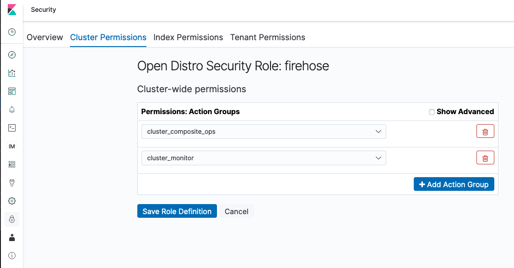
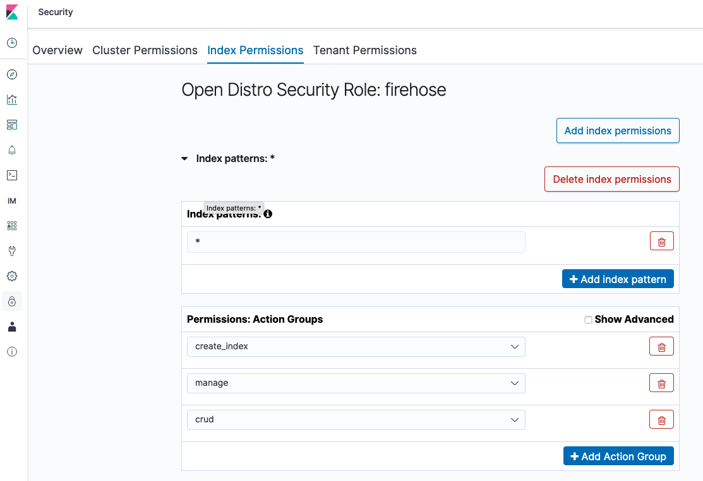
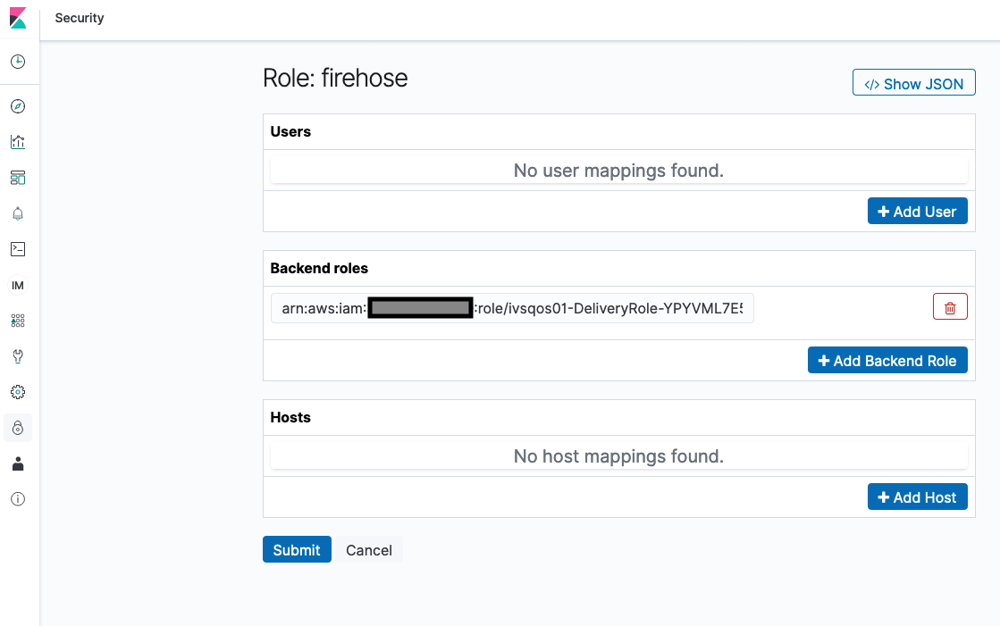
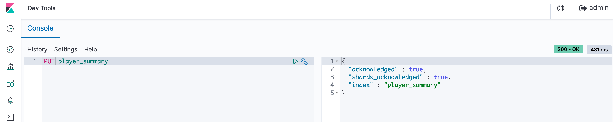
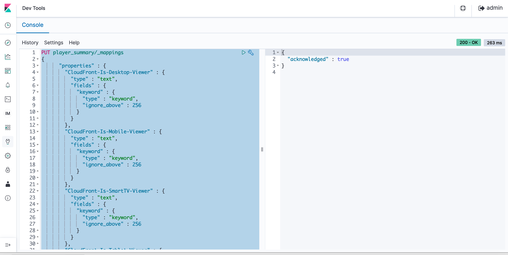
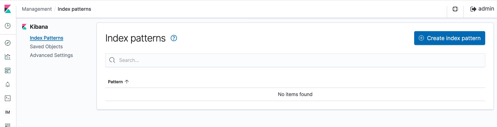
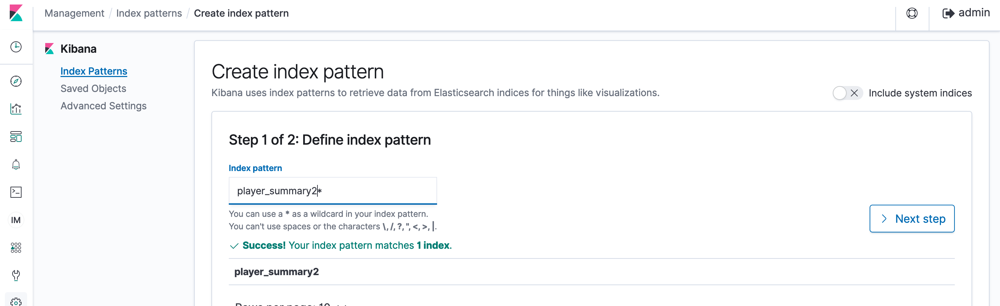

## Configuring ElasticSearch

### Deploying AWS ElasticSearch

Currently, this solution only supports delivery to AWS ElasticSearch clusters with a public-endpoint and fine-grained access control enabled. To deploy an ElasticSearch cluster to receive metrics from the solution, follow these steps:

1. Navigate to the AWS ElasticSearch Management Console in a supported region (us-east-1, us-west-2, eu-west-1)
1. Create a new Domain
1. Determine if you which to deploy as Production or Development and testing, as per your requirements.
1. Complete the basic infrastructure configuration settings for the domain. Note that fine-grained access control is not supported on the t2.* family of instance-types. We recommend by default selecting an r5.large.elasticsearch or m5.large.elasticsearch as your node type.
1. Configure Public access for the domain and enable fine-grained access control
1. Select 'Create master user' and create a master username and password with a secure password
1. Configure the Access Policy to "Allow open access to the domain". Note, access to the domain under this configuration is controlled via the Fine-grained access control module within ElasticSearch.

### Allowing Kinesis Firehose to POST to ElasticSearch via Fine-Grained Access Control

In order to configure ElasticSearch to accept logs from the Kinesis Firehose stream, you will need to add a role to your cluster:

1. Navigate to the AWS ElasticSearch Management Console and select your cluster
1. Click the link to Kibana under the Cluster Overview tab
1. Once logged in to Kibana, navigate to Security->Roles via the menu on the left
1. Create a new Role named 'firehose'
1. Grant the following permissions:

``{
  "cluster_permissions": [
    "cluster_composite_ops",
    "cluster_monitor"
  ],
  "index_permissions": [{
    "index_patterns": [
      "*"
    ],
    "allowed_actions": [
      "create_index",
      "manage",
      "crud"
    ]
  }]
}``
1. Note, you can set the value under index_patterns to the prefix of the index you have set when deploying the CloudFormation template for the solution.

Save the changes

### Next map the Kinesis Firehose IAM Role to this new ElasticSearch policy:

1. Navigate to Security->Role Mapping
1. Click the '+' to add a new Role Mapping
1. Select the 'firehose' role from the dropdown menu
1. Under Backend Roles, add the ARN of the Role assigned to Kinesis Firehose which is listed in the CloudFormation Stack output under the value "DeliveryRoleArn" once the template deploys successfully

Save the changes
Now Kinesis Firehose can post to your ES cluster.

### Next define the Elastic Search index and define the schema:

1. Navigate to Dev Tools
1. Create the index by using the `PUT` command followed by the index name. The Elastic Search index name is what you provided while deploying the CloudFormation template in the parameter 'ElasticSearchIndexName'

1. Next create the index schema by using command `PUT INDEX_NAME/_mappings` along with the schema definition available under 'cloudformation/elasticsearch_mappings.json'

### Next define the Elastic Search index pattern:
1. Navigate to Management
1. Click 'Index Patterns' and select 'Create index patterns'

1. Enter the index name and you should see it listed in below search result and click 'Next Step'

1. Select `event_time` as the Time filter field name and click 'Create index pattern'

You should be able to see all the fields in the index and its data types and other search index attributes. At this stage we are ready to start building the dashboards on ElasticSearch.

### Creating the dashboards on Elastic Search:
1. Navigate to Management
1. Click on 'Saved Objects' and click the `Import` link on the right hand side.
1. Select 'export.ndjson' file which is under folder `cloudformation` and import the dashboard.
1. Navigate to Dashboard and select the newly created dashboard.
1. You should see a set of visualizations auto created and its time now to push some events to see the dashboard in action
 
