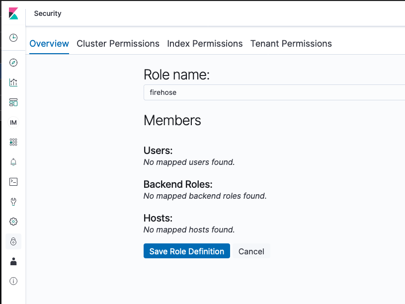

## Configuring ElasticSearch

### Deploying AWS ElasticSearch

Currently, this solution only supports delivery to AWS ElasticSearch clusters with a public-endpoint and fine-grained access control enabled. This guide will show you how to deploy a new ElasticSearch cluster that meets the supported configuration requirements for the solution. 

To deploy an ElasticSearch cluster with fine-grained access control enabled, follow these steps:

1. Navigate to the AWS ElasticSearch Management Console in the region you have deployed the rest of this solution into. 
1. Click on "Create a new Domain"
1. Determine if you which to deploy as "Development and testing" or "Production", as per your requirements.
1. Complete the basic infrastructure configuration settings for the domain. Note that fine-grained access control is not supported on the t2.* family of instance-types so do not select instances from this family. We recommend by default selecting a t3.medium.elasticsearch instance-type if you are simply testing the solution, or start from either a r5.large.elasticsearch or m5.large.elasticsearch instance-type for a production environment.
1. Configure Public access for the domain and enable fine-grained access control
1. Select 'Create master user' and create a master username and password with a secure password
1. Configure the Access Policy to "Allow open access to the domain". Note, access to the domain under this configuration is controlled via the Fine-grained access control module within ElasticSearch.

### Allowing Kinesis Firehose to POST to ElasticSearch via Fine-Grained Access Control

In order to configure ElasticSearch to accept logs from the Kinesis Firehose stream, you will need to add a role to your cluster:

1. Navigate to the AWS ElasticSearch Management Console and select your cluster
1. Click the link to Kibana under the Cluster Overview tab
1. Once logged in to Kibana, open the Security menu by clicking on the lock icon from the list on the left.
1. From the security menu, click on Roles
1. Click on the '+' icon to create a new Role
1. Name the Role 'firehose': 

1. Under the Cluster Permissions tab, grant the following permissions to the role:
- cluster_composite_ops
- cluster_monitor

1. Under the Index Permissions tab, set the index pattern value to match the value specified when you deployed the solution in CloudFormation, with an asterix ('*') appended. Apply the following permissions:

- create_index
- crud

1. Save the changes

### Next map the Kinesis Firehose IAM Role to this new ElasticSearch policy:

1. Navigate to Security->Role Mapping
1. Click the '+' to add a new Role Mapping
1. Select the 'firehose' role from the dropdown menu
1. Under Backend Roles, add the ARN of the Role assigned to Kinesis Firehose which is listed in the CloudFormation Stack output under the value "DeliveryRoleArn" once the template deploys successfully

Save the changes
Now Kinesis Firehose can post to your ES cluster.

### Next define the Elastic Search index and define the schema:

1. Navigate to Dev Tools
1. Create the index by using the `PUT` command followed by the index name. The Elastic Search index name is what you provided while deploying the CloudFormation template in the parameter 'ElasticSearchIndexName'

1. Next create the index schema by using command `PUT INDEX_NAME/_mappings` along with the schema definition available under 'templates/elasticsearch_mappings.json'

### Next define the Elastic Search index pattern:
1. Navigate to Management
1. Click 'Index Patterns' and select 'Create index patterns'

1. Enter the index name and you should see it listed in below search result and click 'Next Step'

1. Select `event_time` as the Time filter field name and click 'Create index pattern'

You should be able to see all the fields in the index and its data types and other search index attributes. At this stage we are ready to start building the dashboards on ElasticSearch.

### Creating the dashboards on Elastic Search:
1. Navigate to Management
1. Click on 'Saved Objects' and click the `Import` link on the right hand side.
1. Select 'export.ndjson' file which is under folder `templates` and import the dashboard.
1. Navigate to Dashboard and select the newly created dashboard.
1. You should see a set of visualizations auto created and its time now to push some events to see the dashboard in action
