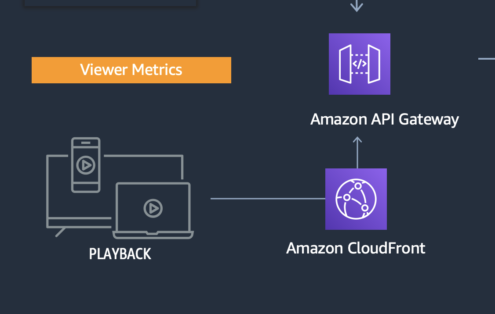

# Metrics Overview

Metrics recording the viewer experience are collected from two sources:

* Client side - Referred to as **Viewer Metrics**
* Server side emitted from IVS via EventBridge - Referred to as **Broadcast Metrics**

The guide below describes these metrics in more detail

## Metric Sources

### Viewer Metrics

1. An event capturing the playback statistics is sent through CloudFront into an API Gateway. The event data is enriched by CloudFront which detects the user geo-location details and forwards them to API Gateway.

2. Within API Gateway, using VTL templates, the event payload is stamped with the event timestamp which is the time when the event was received and the payload structure itself is transformed to correctly represent String and Numeric attributes. The events are POSTed to a Kinesis Firehose stream.

### Broadcast Metrics

1. An EventBridge rule is configured to respond to state and health state changes on an IVS channel. 

2. A Lambda function is triggered by each event and computes metrics including channel concurrency and channel duration. These metrics are delivered to the event stream as additional metric types for delivery to downstream systems (S3, ElasticSearch).

3. Parameter store is used as a transient store for storing channel specific information like start time of channel, no.of channels.

## Metric Schema

## Downstream Metrics Processing

1. For near real time actionable insights, a Kinesis Data Analytics Application computes and aggregates metrics like Live Latency, Concurrent Users, Buffer Ratio, Errors across all platforms (web, android, ios)

2. The events are buffered in Kinesis Firehose and sent to Elasticsearch cluster within a pre-defined index after record validation using a Lamda function

3. An S3 bucket is configured as a sink to capture all events which are ingested. This data is partitioned as YYYY/MM/DD/HH and it helps in efficient query performance.

4. The data schema is stored in Glue Catalog and Athena uses it to query the data for visualization using QuickSight. QuickSight is used for long term reporting.

