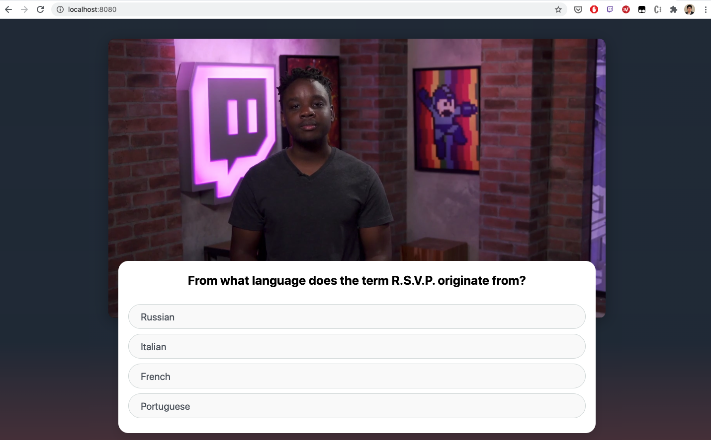
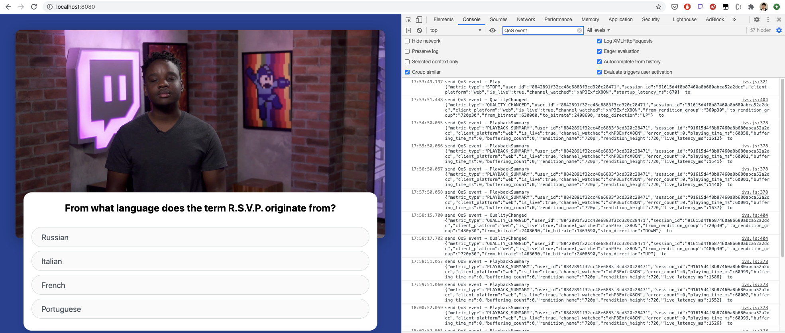
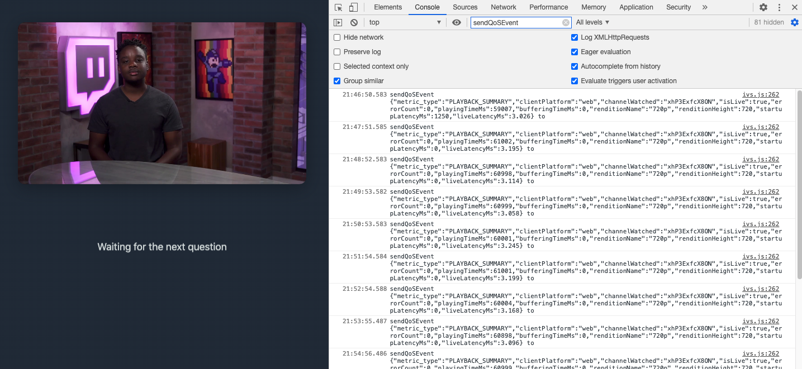
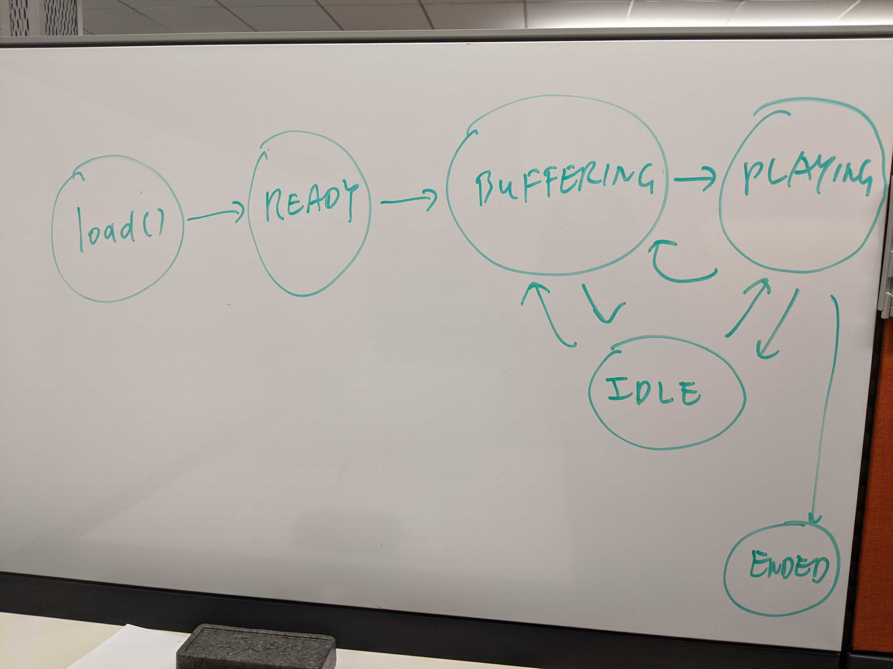
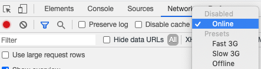
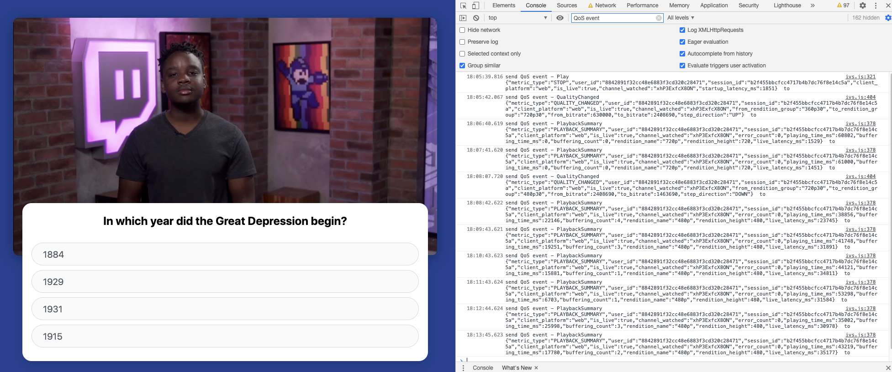
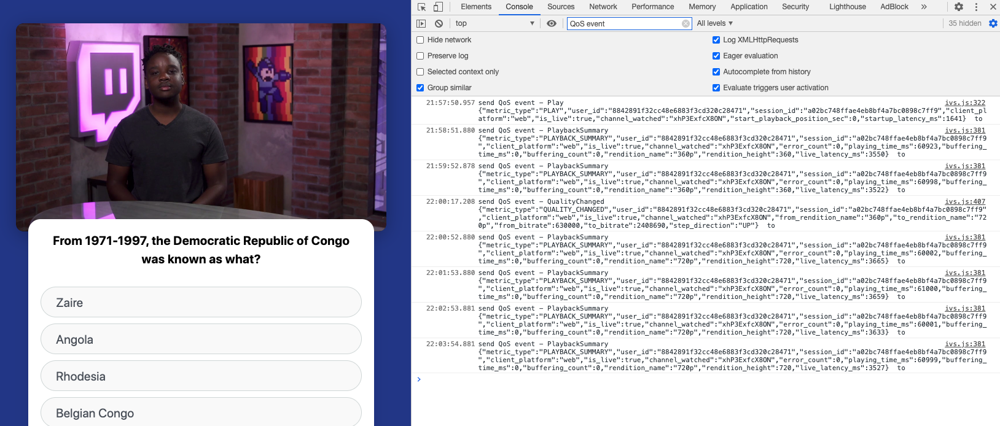

# Sample Web Player of Amazon IVS Quality-Of-Service and Timed-Metadata-Feedback Dashboard

## 1. What Does the Sample Web Player Do

This sample web player is written based on IVS player SDK 1.0.0, and can

- Play an IVS live stream (or an IVS VOD asset);

- Based on the player SDK's events, assemble playback QoS events and send them to an IVS QoS dashboard backend;

- Render multiple-choice questions based on the timed metadata embedded in an IVS live (or VOD) video, assemble question/answer events and send them to an IVS timed-metadata-feedback dashboard backend.

## 2. Play With the Sample Web Player Yourself

### 2.1 Host Nginx on Your Local Computer

**Step 1:** On Mac, you can install Nginx with Homebrew by running:

- ```$ brew update```;

- ```$ brew install nginx```.

**Step 2:** Point the root directory to the folder of this sample web player, e.g., */Users/yuesshen/aws-samples/amazon-ivs-qos-dashboard-timed-metadata-sample/web/IVSplayer*

- Modify */usr/local/etc/nginx/nginx.conf* as

```
http {
    ...
    server {
        listen       8080;
        server_name  localhost;

        location / {
            root /Users/yuesshen/aws-samples/amazon-ivs-qos-dashboard-timed-metadata-sample/web/IVSplayer;
            index  index.html index.htm;
        }
    ...
```

**Step 3:** Run Nginx in background

- To start Nginx, run ```sudo brew services start nginx```;

- After you are done with your experiment, run ```sudo brew services stop nginx``` to stop Nginx.

### 2.2 Run the Sample Web Player and See the Assembled Timed-Metadata-Feedback & Playback-QoS Events

In Chrome, type *http://localhost:8080/* in the web address bar, the sample web player will play a test channel with multiple-choice questions (see below). If your selected answer is correct, the answer window will turn green, otherwise it will be red.



When a viewer answers a multiple-choice question, a timed-metadata-feedback event will be assembled and sent to the backend. To see the console output for these events,

- Open the Chrome Developer Tool (in Chrome, select "View", "Developer", "Developer Tool");

- Select "Console";

- Type *"sendQuizAnswer"* in "Filter";

- See the timed-metadata-feedback events including the question and the selected answer (see below).



Furthermore, the sample web player also assembles a playback QoS event and send to the the backend every minute. To see the console output for these events, similar as above,

- Type *"sendQoSEvent"* in "Filter";

- See the playback QoS events, each of which is a summary of the past minute's playback state (see below).



### 2.3 Customize Your IVS Video and Dashboard Backend

In *.js/config.js*, replace the default values with the playback URL of your IVS live (or VOD) video, also add the Gateway API end points of your backend:

- ```"PlaybackURL":``` an IVS live channel (or VOD title)'s playback URL;

- ```"SendQoSEventURL":``` end point for sending playback QoS (i.e., playback summary) events;

- ```"SendQuizAnswerURL":``` end point for sending timed metadata feedback (e.g., quiz answer) events.

## 3. Deep Dive Into the Design and the Source Code

### 3.1 Playback QoS Events

#### 3.1.1 Submission Frequency and Metrics Covered

Each player QoS event

- is about one viewer watching one particular channel; and

- covers maximum one minute (which is adjustable, and is a tradeoff between latency and cost).

Furthermore, if the player state is either “IDLE” or “ENDED” throughout the entire minute, no event will be sent for this minute.

The data collected within the QoS events can be leveraged to generate two types of metrics:

- User activity:

  - Concurrent viewers;

  - Client platform type;

  - Duration watched.

- QoS

  - Rendition watched;

  - Startup latency (delay from loading the playback URL to the first video frame rendered);

  - Live latency (delay from ingest to playback, i.e., end-to-end latency excluding the broadcast tool's latency);

  - Playback buffering;

  - Playback errors.

#### 3.1.2 JSON Schema

| Field Name | Data Type | Note |
| ---------- | --------- | ---- |
|  |  | **// event type (QoS, timed metadata feedback, etc.)** |  
| metric_type | string | "PLAYBACK_SUMMARY" for QoS event |
|  |  | **// client platform and content** |  
| client_platform | string | e.g., “web”, “android”, “ios” |
| channel_watched | string | the string after ".channel." in the playback URL, e.g., “xhP3ExfcX8ON” for the test channel |
| is_live | boolean |  |
|  |  | **// playback summary** |  
| error_count | integer |  |
| playing_time_ms | integer | the duration (in ms) of the player SDK staying in the "PLAYING" state |
| buffering_time_ms | integer | the duration (in ms) of the player SDK staying in the "BUFFERING" state |
| rendition_name | string | e.g., "Source", "720p60", "720p", "480p", "240p", "160p" (snapshot taken right before the event is sent) |
| rendition_height | integer | (snapshot taken right before the event is sent) |
| startup_latency_ms | integer | latency  in ms from load() being called to state becoming PLAYING. Value is only valid in the very first event of playing a channel, and is set to 0 in following events, i.e., the 2nd/3rd/... minute of the playback session |
| live_latency_ms | integer | latency in ms based on "getLiveLatency()" covering the latency from ingest to playback (i.e., not include the latency of broadcast tool), live only. set to -1, if VOD |

#### 3.1.3 Implementation

Search for *"QoS event"* in *ivs.js* and see the implementation of the following logic:

- Definition of the work variables, right after the creation of ```IVSPlayer``` (from line 39);

- Send off the dangling QoS event and reset the work variables before loading a new video (from line 147);

- Send off a QoS event and reset some work varibles every minute (from line 186);

- Subroutine of assembing an QoS event and sending it to the QoS dashboard backend (from line 266);

- Update work variables (whose values are used in assembing QoS events), when receiving a player-state-change (see below) or playback-error event from the IVS player SDK (from line 57).



#### 3.1.4 Test Plan

To execute the test plan, you might need to use the Chrome Developer Tool's "Network", "Throttling" (see below).



Test plan:

- #1 Good network condition - Play the test channel under a reliable network condition having >10mbps bandwidth;

- #2 Changing network contiion - Start from unthrottled, then throttle to 1mbps after seeing the 2nd QoS event;

- #3 Changing network contiion - Start from throttled 1mbps, then unthrottle the bandwidth after seeing the 2nd QoS event.

Reference test result:

| Test Case | Which QoS Event | Expected *startupLatencyMs* | *playingTimeMs* | *bufferingTimeMs* | *renditionHeight* | *LiveLatencyMs* | *errorCount* |
| --------- | --------------- | --------------------------- | --------------- | ----------------- | --------------- | --------------- | ------------ |
| #1 | 1st       | ~2s | ~58s | ~0s | 720 | ~3s | ~0 |
|    | Following | 0s  | ~60s | ~0s | 720 | ~3s | ~0 |
| #2 | 1st       | ~2s | ~58s | ~0s | 720 | ~3s | ~0 |
|    | 2nd       | 0s  | ~60s | ~0s | 720 | ~3s | ~0 |
|    | 3rd       | 0s  | >55s | <5s | 360 | <6s | ~0 |
|    | 4th       | 0s  | ~60s | ~0s | 360 | <6s | ~0 |
| #3 | 1st       | ~5s | ~55s | ~0s | 360 | <5s | ~0 |
|    | 2nd       | 0s  | ~60s | ~0s | 360 | <5s | ~0 |
|    | 3rd       | 0s  | ~60s | ~0s | 720 | <5s | ~0 |
|    | 4th       | 0s  | ~60s | ~0s | 720 | <5s | ~0 |

Below are the screenshots of the console output for test case 2 & 3, also see section 2.2 for the console output for test case 1.





### 3.2 Timed-Metadata-Feedback Events

#### 3.2.1 Submission Triggering and Content Included

When a viewer receives a multiple-choice question and select an answer, an timed-metadata-feedback event will be sent to the backend, including the question and the answer selected.

#### 3.2.2 JSON Schema

| Field Name | Data Type | Note |
| ---------- | --------- | ---- |
|  |  | **// event type (QoS, timed metadata feedback, etc.)** |
| metric_type | string | "QUIZ_ANSWER" in this example |
|  |  | **// client platform and content** |
| question | string | e.g., "Which team won the 2019 World Series?" |
| answer | string | e.g., "Washington Nationals" |

#### 3.2.3 Implementation

Search for *"timed metadata"* in *ivs.js* and see how ```sendQuizAnswer()``` is called and implemented.

#### 3.2.4 Test Plan

As stated in section 2.2, check the console output when a multiple-choice answer is selected.
